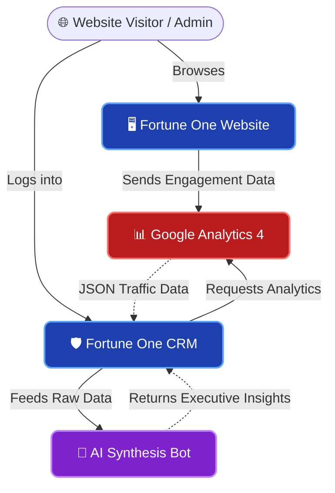

  
# 🏢 Fortune One Ecosystem
**An enterprise-grade architecture housing a Corporate Website, CRM, AI-powered conversational bots, and a highly advanced Google Analytics 4 (GA4) Executive Dashboard.**

---

## 🗺️ System Architecture

The ecosystem operates seamlessly across four major pillars. Below is a high-level flowchart of how data and users move through the Fortune One infrastructure:

---

## 🧩 Core Components

### 1. 🖥️ Fortune One Website (Public Facing)
Designed to convert visitors and showcase the brand with a modern aesthetic.
- **MVC Routing:** Managed through CodeIgniter 4 controllers (`app/Controllers/Website`).
- **Componentized Views:** UI components like the hero slider and footers are modularized in `app/Views/Website/Partials/` for high reusability.
- **Deep Analytics:** A custom Vanilla JS IntersectionObserver (`section-tracker.js`) monitors exactly how long users linger on specific website sections, firing custom GA4 events for behavioral analytics.

### 2. 🛡️ Fortune One CRM (Internal Platform)
The administrative backbone of Fortune One operations.
- **Backend Core:** A secure CodeIgniter 4 MVC pattern handling database interactions and API endpoints (`app/Controllers/FortuneOneCRM/`).
- **Security:** Built on robust session-based authentication and restricted directory structures.

### 3. 🤖 AI Bot & Integrations
Synthesizing raw data into actionable intelligence.
- **Automated Synthesis:** The CRM features an *"AI Automated Fact & Analytical Brief"* that digests complex data into readable executive summaries.
- **Microservices:** Node.js integration layers (`test_node.js`) allow for seamless server-to-server communication with external AI providers.

### 4. 📊 Executive GA4 Analytics Dashboard
A premium, highly interactive dashboard built to visualize Google Analytics directly within the CRM—no need to log into the Google Cloud Console.

> **Backend Flow (`AdminController.php`):**
> Authenticates securely via `credentials.json` with the Google Analytics Data API (Beta) to pull Global Metrics, Geographic Heatmaps, Hardware Share, Page Matrices, and Platform Referrals.

> **Frontend Flow (`dashboard.php`):**
> Built with a dark-mode glassmorphism aesthetic using Tailwind CSS. Features dynamic date filtering and utilizes **Chart.js** for real-time, responsive rendering of Traffic Chronologies, Doughnut Charts, and Polar Area matrices. Includes one-click **PDF Export** using `html2pdf.js`.

---

## 🚀 Setup & Installation

### Prerequisites
- **PHP 7.4+** & Composer
- Local Server Environment (XAMPP, MAMP, Nginx)
- **Node.js** (Optional, for running specific microservices)

### Step-by-Step Guide
1. **Environment Configuration**
   Clone the repository and copy `env` to `.env`. Configure your `app.baseURL` and database credentials. Run `composer install`.
   
2. **Google Analytics API (GA4) Setup**
   Enable the Google Analytics Data API in the Google Cloud Console. Create a Service Account, download the JSON key, and save it to `public/assets/credentials.json`.
   
3. **Connect the Property**
   Update your GA4 `Property ID` in `AdminController.php` and give the Service Account email `Viewer` access in your GA4 Property settings.

4. **Launch**
   Start your Apache server.
   - Public Website: `http://localhost/fortune/public/`
   - GA4 CRM Dashboard: `http://localhost/fortune/public/admin/analytics`

---

## 🔒 Security Best Practices
- Sensitive directories (`node_modules`, `vendor`) and environment variables (`.env`) are hidden via `.gitignore`.
- **GCP Service Keys:** The `credentials.json` keys are strictly excluded from version control via multi-layered `.gitignore` rules to protect Google Cloud billing limits. 

---

  <i>Engineered for Growth, Insights, and Automation.</i>

